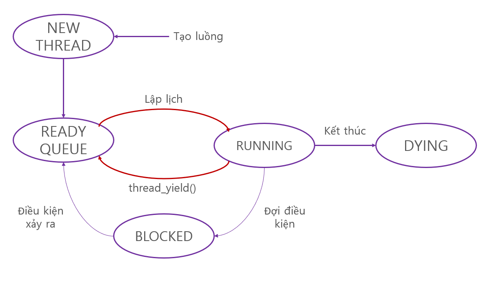

# Document for Pintos Projects

Ngày thực hiện: 18/05/2021

Author: Nguyễn Hồng Phước

------

[TOC]


------

## Overview

 Bài viết triển khai vấn đề `alarm-clock` bằng cách sửa đổi một số hàm trong `src/threads` và `src/devices`. Trong bài viết này,

- Phần [Analysis](#Analysis): trình bày cụ thể quá trình phân tích hàm `timer_sleep()` và các hàm liên quan.
- Phần [Summary](#Summary): cô đọng các vấn đề sau khi đã phân tích.
- Phần [Solution](#Solution): trình bày phần code đã sửa đổi, kiểm tra và đánh giá kết quả đã đạt được.

## Environment

- Hệ điều hành: Linux Ubuntu 18.04.5 - phiên bản kernel 5.4.0-73-generic

- Cấu hình môi trường (sử dụng qemu):

  Tham khảo:  [pintos-with-qemu](https://github.com/ivogeorg/os-playground/blob/master/pintos-with-qemu.md)

- Địa chỉ mã triển khai thử nghiệm:

  Tham khảo: [pintos-anon](https://github.com/WyldeCat/pintos-anon)

- Công cụ gỡ lỗi: gdb

## Rules

Chạy hệ điều hành Pintos thông qua qemu, hệ điều hành sẽ in kết quả chạy theo quá trình triển khai của Pintos và đánh giá xem việc triển khai Pintos có đáp ứng yêu cầu hay không bằng cách so sánh kết quả đầu ra tiêu chuẩn so với đầu ra thực tế.

## Project 1: THREADS

Mục tiêu của bài viết này là thực hiện phân tích và giải quyết Problem 1 (Alarm Clock) trong Project 1.

### Problem 1: Alarm Clock - Busy waiting

Theo [Requirements]([https://web.stanford.edu/~ouster/cgi-bin/cs140-spring20/pintos/pintos_2.html) của đại học Stanford, đối với problem Alarm Clock, vấn đề hiện có trong hệ điều hành là khi thực hiện một thread nào đó thì nó luôn ở trạng thái sẵn sàng để chạy, điều này dẫn tới việc luôn chiếm dụng tài nguyên CPU, gây lãng phí tài nguyên (**busy waiting** - nguyên nhân sẽ được phân tích bên dưới). Yêu cầu đặt ra là thực hiện lại hàm `timer_sleep()` trong `devices/timer.c` để tránh tình trạng **busy waiting**.

#### Analysis

**Tìm hiểu hàm** `timer_sleep()`

Hệ thống ban đầu được triển khai bằng cách sử dụng phương thức **busy waiting**, tức là, luồng tiếp tục lặp lại cho đến khi hết một khoảng thời gian nào đó.

Trước tiên, hãy xem việc triển khai `timer_sleep()` trong `devices/timer.c`:

```c
/* Sleeps for approximately TICKS timer ticks.  Interrupts must
    be turned on. */
 void
 timer_sleep (int64_t ticks)
 {
   int64_t start = timer_ticks ();
   ASSERT (intr_get_level () == INTR_ON);
   while (timer_elapsed (start) < ticks)
     thread_yield();
 }
```

Nguyên nhân của tình trạng **busy waiting** là dòng 8 và dòng 9, vì hàm `thread_yield()` trong `threads/thread.c` được triển khai như sau: khi luồng hiện tại không rảnh rỗi, nó sẽ được đẩy vào READY QUEUE, làm cho luồng luôn ở trong trạng thái sẵn sàng chạy.

Hàm `thread_yield()` trong `threads/thread.c`:

```c
/* Yields the CPU.  The current thread is not put to sleep and
   may be scheduled again immediately at the scheduler's whim. */
void
thread_yield (void)
{
  struct thread *cur = thread_current ();
  enum intr_level old_level;

  ASSERT (!intr_context ());

  old_level = intr_disable ();
  if (cur != idle_thread)
     list_push_back (&ready_list, &cur->elem); 
   
  cur->status = THREAD_READY;
  schedule ();
  intr_set_level (old_level);
}
```

Dòng 12 - 13 cho thấy rõ vấn đề này.

Để hiểu chi tiết hơn, bài viết phân tích cụ thể cách hoạt động của các hàm liên quan đến `timer_sleep()` ở bên dưới (tham khảo) hoặc bạn có thể tới trực tiếp phần [Tổng kết phân tích](#Summary) hoặc [Solution](#Solution) (ctrl + click).


**Phân tích vấn đề Busy waiting**

Dòng 6 `timer_sleep()`: Hàm `timer_ticks()` được gọi, hãy xem hàm này có chức năng gì?

```c
 /* Returns the number of timer ticks since the OS booted. */
 int64_t
 timer_ticks (void)
 {
   enum intr_level old_level = intr_disable ();
   int64_t t = ticks;
   intr_set_level (old_level);
   return t;
 }
```

Nhận thấy `intr_level` ở đây đã trả về một kết quả thông qua `intr_disable()`, tiếp tục xem xét

```c
 /* Interrupts on or off? */
 enum intr_level 
   {
     INTR_OFF,             /* Interrupts disabled. */
     INTR_ON               /* Interrupts enabled. */
   };
```

```c
 /* Disables interrupts and returns the previous interrupt status. */
 enum intr_level
 intr_disable (void) 
 {
   enum intr_level old_level = intr_get_level ();
 
   /* Disable interrupts by clearing the interrupt flag.
      See [IA32-v2b] "CLI" and [IA32-v3a] 5.8.1 "Masking Maskable
      Hardware Interrupts". */
   asm volatile ("cli" : : : "memory");
 
   return old_level;
 }
```

Như vậy,`intr_level` cho biết việc kích hoạt ngắt hay không, và `intr_disable()` thực hiện hai việc: 

1. Gọi intr_get_level () 
2. Thực thi trực tiếp mã hợp ngữ và gọi các lệnh hợp ngữ để đảm bảo rằng luồng này không thể bị ngắt.

Hàm `intr_get_level()`:

```c
 /* Returns the current interrupt status. */
 enum intr_level
 intr_get_level (void) 
 {
   uint32_t flags;
 
   /* Push the flags register on the processor stack, then pop the
      value off the stack into `flags'.  See [IA32-v2b] "PUSHF"
      and "POP" and [IA32-v3a] 5.8.1 "Masking Maskable Hardware
      Interrupts". */
   asm volatile ("pushfl; popl %0" : "=g" (flags));
 
   return flags & FLAG_IF ? INTR_ON : INTR_OFF;
 }
```

Hàm này gọi lệnh hợp ngữ, đặt thanh ghi cờ trên ngăn xếp của bộ xử lý, sau đó bật giá trị cho các cờ (đại diện cho bit IF của thanh ghi cờ) và trả về trạng thái ngắt hiện tại `intr_level` bằng cách đánh giá các cờ.

Tóm lại, các bước thực hiện `intr_disable()`

1. `intr_get_level()` trả về giá trị của `intr_level`
2. `intr_disable()` có trạng thái ngắt hiện tại, vô hiệu hóa ngắt, sau đó trả về trạng thái ngắt trước khi bị vô hiệu hóa.

Với kết luận trên thì dòng 5 của `timer_ticks()` thực hiện: vô hiệu hóa ngắt hiện tại và lưu trạng thái ngắt trước khi vô hiệu hóa (được lưu trữ bởi `old_level`).

Xem xét phần còn lại của `timer_ticks()` , sử dụng `t` để lấy biến toàn cục `ticks`, rồi trả về `t`, hàm này gọi hàm `set_level()`. Hàm `set_level()`:

```c
 /* Enables or disables interrupts as specified by LEVEL and
    returns the previous interrupt status. */
 enum intr_level
 intr_set_level (enum intr_level level) 
 {
   return level == INTR_ON ? intr_enable () : intr_disable ();
 }
```

So sánh mức level của ngắt được đặt trong `level` với `INTR_ON`, đúng thì hãy kích hoạt ngắt còn sai thì vô hiệu hóa ngắt. Cả `intr_enable()` và `intr_disable()` đều trả về trạng thái của ngắt trước khi được kích hoạt/vô hiệu hóa.

Hàm `intr_enable()`:

```c
 /* Enables interrupts and returns the previous interrupt status. */
 enum intr_level
 intr_enable (void) 
 {
   enum intr_level old_level = intr_get_level ();
   ASSERT (!intr_context ());
 
   /* Enable interrupts by setting the interrupt flag.
 
      See [IA32-v2b] "STI" and [IA32-v3a] 5.8.1 "Masking Maskable
      Hardware Interrupts". */
   asm volatile ("sti");
 
   return old_level;
 }
```

Trong asm, lệnh `"sti"` đối lập với lệnh `"cli"`, tức là bit IF được đặt thành 1.

Sau đó, `ASSERT` khẳng định lại `!intr_context ()`.

Hàm `intr_context()`

```c
 /* Returns true during processing of an external interrupt
    and false at all other times. */
 bool
 intr_context (void) 
 {
   return in_external_intr;
 }
```

Cờ `in_external_intr` cho biết liệu ngắt bên ngoài có được trả về trực tiếp hay không, có nghĩa là ASSERT khẳng định rằng ngắt này không phải là ngắt ngoài (IO, v.v., còn được gọi là ngắt cứng) mà là ngắt bên trong (còn gọi là ngắt mềm) trong chuyển mạch luồng bình thường (trong quy trình của hệ điều hành).

Dòng 5 và 7 trong `timer_ticks()` là để đảm bảo rằng quá trình này không thể bị gián đoạn.

```c
 enum intr_level old_level = intr_disable ();
 ...
 intr_set_level (old_level);
```

Vậy `ticks` là gì?

```c
 /* Number of timer ticks since OS booted. */
 static int64_t ticks;
```

Kể từ khi Pintos được khởi động, số lượng `ticks` được đếm, đại diện cho phép đo đơn vị thời gian của hệ điều hành.

Trong hàm `timer_sleep()`, `(start)` lấy thời gian bắt đầu và sau đó nó phải bị ngắt, nếu không nó sẽ tiếp tục lặp vô hạn.

```c
 while (timer_elapsed (start) < ticks)
   thread_yield();
```

*<u>Lưu ý:</u>* biến `ticks` dùng trong trường hợp này là một tham số hàm chứ không phải là một biến toàn cục. Hàm `timer_elapsed()`:

```c
 /* Returns the number of timer ticks elapsed since THEN, which
    should be a value once returned by timer_ticks(). */
 int64_t
 timer_elapsed (int64_t then)
 {
   return timer_ticks () - then;
 }
```

Như vậy hàm `timer_elapsed()` trả về khoảng thời gian giữa `timer_ticks()` và `then`, vì vậy bản chất của vòng lặp `while()` trong `timer_sleep()` là liên tục thực thi `thread_yield()` trong khoảng thời gian `ticks`.

Hàm `thread_yield()` :

```c
 /* Yields the CPU.  The current thread is not put to sleep and
    may be scheduled again immediately at the scheduler's whim. */
 void
 thread_yield (void)
 {
   struct thread *cur = thread_current ();
   enum intr_level old_level;
 
   ASSERT (!intr_context ());
 
   old_level = intr_disable ();
   if (cur != idle_thread)
     list_push_back (&ready_list, &cur->elem);
   cur->status = THREAD_READY;
   schedule ();
   intr_set_level (old_level);
 }
```

Hàm `thread_current()`:

```c
 /* Returns the running thread.
    This is running_thread() plus a couple of sanity checks.
    See the big comment at the top of thread.h for details. */
 struct thread *
 thread_current (void)
 {
   struct thread *t = running_thread ();
 
   /* Make sure T is really a thread.
      If either of these assertions fire, then your thread may
      have overflowed its stack.  Each thread has less than 4 kB
      of stack, so a few big automatic arrays or moderate
      recursion can cause stack overflow. */
   ASSERT (is_thread (t));
   ASSERT (t->status == THREAD_RUNNING);
 
   return t;
 }
```

 Hàm `running_thread()`:

```c
 /* Returns the running thread. */
 struct thread *
 running_thread (void)
 {
   uint32_t *esp;
 
   /* Copy the CPU's stack pointer into `esp', and then round that
      down to the start of a page.  Because `struct thread' is
      always at the beginning of a page and the stack pointer is
      somewhere in the middle, this locates the curent thread. */
   asm ("mov %%esp, %0" : "=g" (esp));
   return pg_round_down (esp);
 }
```

Hàm `is_thread()`:

```c
 /* Returns true if T appears to point to a valid thread. */
 static bool
 is_thread (struct thread *t)
 {
   return t != NULL && t->magic == THREAD_MAGIC;
 }
```

Hàm `running_thread()` được gọi bởi `thread_current()`, sao chép con trỏ của ngăn xếp CPU vào `esp`, sau đó gọi `pg_round_down`.

```c
 /* Round down to nearest page boundary. */
 static inline void *pg_round_down (const void *va) {
   return (void *) ((uintptr_t) va & ~PGMASK);
 }
```

 Cách Pintos thiết kế Pages:

```c
 /* Page offset (bits 0:12). */
#define PGSHIFT 0                          /* Index of first offset bit. */
#define PGBITS  12                         /* Number of offset bits. */
#define PGSIZE  (1 << PGBITS)              /* Bytes in a page. */
#define PGMASK  BITMASK(PGSHIFT, PGBITS)   /* Page offset bits (0:12). */
```

```c
 /* Functions and macros for working with virtual addresses.
 
    See pte.h for functions and macros specifically for x86
    hardware page tables. */
 
#define BITMASK(SHIFT, CNT) (((1ul << (CNT)) - 1) << (SHIFT))
```

Đối với một trang có 12 bit, `PGMASK` gọi `BITMASK` là một mặt nạ với tất cả các bit của trang là 1. 

*<u>Lưu ý:</u>* 1ul có nghĩa là 1 không dấu.

Xem xét `pg_round_down`, thực hiện `va & ~PGMASK` là kích thước trang đầy đủ chẳng hạn như số 0, và sau đó chuyển qua một con trỏ với kết quả của hoạt động được xóa con trỏ 12 ở bên phải.

Tác dụng ở đây là gì? Chúng ta biết rằng một trang có 12 bit và chuỗi struct nằm ở đầu trang, do đó, kết quả của `pg_round_down` trên bất kỳ con trỏ trang nào là trở lại vị trí của cấu trúc luồng bắt đầu của trang.

Như vậy, `pg_round_down` trả về con trỏ bắt đầu của luồng trang này, sau đó kết quả của `running_thread()` trả về con trỏ bắt đầu của luồng hiện tại.

Xem xét `thread_current()` trong hai `ASSERT` cuối cùng, khẳng định `t` trỏ vào đầu của một thread, và thread này có trạng thái `THREAD_RUNNING.`

Trong hàm `is_thread()` , `t->magic` được sử dụng để phát hiện một phần tử khi có tràn ngăn xếp.

```c
 /* Owned by thread.c. */
 unsigned magic;                     /* Detects stack overflow. */
```

Tổng kết, `thread_current()` trả về vị trí con trỏ bắt đầu luồng hiện tại.

Tiếp tục phân tích phần còn lại trong hàm `thread_yield()`. Dòng 9 là khẳng định đây là ngắt mềm, dòng 11 và 16 là hoạt động đảm bảo cơ chế luồng thực thi không bị ngắt. Dòng 12 - 15:

```c
 if (cur != idle_thread)
   list_push_back (&ready_list, &cur->elem);
 cur->status = THREAD_READY;
 schedule ();
```

Nếu luồng hiện tại không rảnh, gọi `list_push_back()` để đưa các phần tử của luồng hiện tại vào hàng đợi ready và thay đổi trạng thái luồng thành `THREAD_READY`. Sau đó call hàm `schedule()`:

```c
 /* Schedules a new process.  At entry, interrupts must be off and
    the running process's state must have been changed from
    running to some other state.  This function finds another
    thread to run and switches to it.
 
    It's not safe to call printf() until thread_schedule_tail()
    has completed. */
 static void
 schedule (void)
 {
   struct thread *cur = running_thread ();
   struct thread *next = next_thread_to_run ();
   struct thread *prev = NULL;
 
   ASSERT (intr_get_level () == INTR_OFF);
   ASSERT (cur->status != THREAD_RUNNING);
   ASSERT (is_thread (next));
 
   if (cur != next)
     prev = switch_threads (cur, next);
   thread_schedule_tail (prev);
 }
```

Đầu tiên, lấy `cur` luồng hiện tại và gọi `next_thread_to_run()` để chạy luồng tiếp theo:

Hàm `next_thread_to_run()`:

```c
 /* Chooses and returns the next thread to be scheduled.  Should
    return a thread from the run queue, unless the run queue is
    empty.  (If the running thread can continue running, then it
    will be in the run queue.)  If the run queue is empty, return
    idle_thread. */
 static struct thread *
 next_thread_to_run (void)
 {
   if (list_empty (&ready_list))
     return idle_thread;
   else
     return list_entry (list_pop_front (&ready_list), struct thread, elem);
 }
```

Nếu hàng đợi ready không hoạt động, trả về con trỏ luồng nhàn rỗi, nếu không, trả về luồng đầu tiên của hàng đợi ready.

3 lệnh `ASSERT` trong `schedule()` đảm bảo rằng chúng không thể bị gián đoạn, luồng hiện tại là RUNNING_THREAD, v.v. Nếu `cur` (luồng hiện tại) và `next` (luồng tiếp theo) không giống nhau, gọi `switch_threads()` được gán vào `prev`.

```c
 /* Switches from CUR, which must be the running thread, to NEXT,
    which must also be running switch_threads(), returning CUR in
    NEXT's context. */
 struct thread *switch_threads (struct thread *cur, struct thread *next);
```

*<u>Lưu ý:</u>* chức năng này được thực hiện bằng hợp ngữ trong `threads/switch.S`:

```c
 #### struct thread *switch_threads (struct thread *cur, struct thread *next);
 ####
 #### Switches from CUR, which must be the running thread, to NEXT,
 #### which must also be running switch_threads(), returning CUR in
 #### NEXT's context.
 ####
 #### This function works by assuming that the thread we're switching
 #### into is also running switch_threads().  Thus, all it has to do is
 #### preserve a few registers on the stack, then switch stacks and
 #### restore the registers.  As part of switching stacks we record the
 #### current stack pointer in CUR's thread structure.
 
 .globl switch_threads
 .func switch_threads
 switch_threads:
     # Save caller's register state.
     #
     # Note that the SVR4 ABI allows us to destroy %eax, %ecx, %edx,
     # but requires us to preserve %ebx, %ebp, %esi, %edi.  See
     # [SysV-ABI-386] pages 3-11 and 3-12 for details.
     #
     # This stack frame must match the one set up by thread_create()
     # in size.
     pushl %ebx
     pushl %ebp
     pushl %esi
     pushl %edi
 
     # Get offsetof (struct thread, stack).
 .globl thread_stack_ofs
     mov thread_stack_ofs, %edx
 
     # Save current stack pointer to old thread's stack, if any.
     movl SWITCH_CUR(%esp), %eax
     movl %esp, (%eax,%edx,1)
 
     # Restore stack pointer from new thread's stack.
     movl SWITCH_NEXT(%esp), %ecx
     movl (%ecx,%edx,1), %esp
 
     # Restore caller's register state.
     popl %edi
     popl %esi
     popl %ebp
     popl %ebx
         ret
 .endfunc
```

Phân tích mã hợp ngữ này: Đầu tiên, 4 thanh ghi được đẩy lên ngăn xếp để lưu trạng thái thanh ghi (chức năng bảo vệ). 4 thanh ghi này là thành phần của `switch_threads_frame`:

```c
 /* switch_thread()'s stack frame. */
 struct switch_threads_frame 
   {
     uint32_t edi;               /*  0: Saved %edi. */
     uint32_t esi;               /*  4: Saved %esi. */
     uint32_t ebp;               /*  8: Saved %ebp. */
     uint32_t ebx;               /* 12: Saved %ebx. */
     void (*eip) (void);         /* 16: Return address. */
     struct thread *cur;         /* 20: switch_threads()'s CUR argument. */
     struct thread *next;        /* 24: switch_threads()'s NEXT argument. */
   };
```

Sau đó, biến toàn cục `thread_stack_ofs` ghi lại khoảng cách giữa luồng và ngăn xếp. Lưu ý rằng chuyển mạch luồng có một quá trình lưu lại cảnh.

Nhìn vào dòng 34 và 35, trước tiên đặt con trỏ luồng hiện tại vào `eax`, và lưu con trỏ luồng trong một địa chỉ lệch so với địa chỉ cơ sở của `edx`.

Dòng 38, 39: chuyển sang con trỏ ngăn xếp luồng của luồng tiếp theo, lưu nó trong `ecx`, sau đó đặt địa chỉ offset của địa chỉ cơ sở tương đối của luồng này (được lưu trữ khi cảnh được lưu lần trước) vào `esp` để tiếp tục thực thi.

Ở đây `ecx`, `eax` đóng vai trò của vùng chứa và `edx` trỏ đến phần bù địa chỉ được lưu trong cảnh hiện tại.

Nói một cách đơn giản, đó là lưu trạng thái luồng hiện tại và khôi phục trạng thái luồng đã lưu trước luồng mới.

Sau đó lấy ra 4 thanh ghi. Đây là yêu cầu của thiết kế phần cứng. Các thanh ghi trong `switch_threads_frame` phải được bảo vệ để hủy `eax`, `edx` và `ecx`.

Chú ý rằng `eax` (giá trị trả về của hàm là `eax`) là con trỏ ngăn xếp của luồng đang được chuyển.

*<u>Kết luận:</u>* `schedule()` trước tiên đưa luồng hiện tại vào hàng đợi ready, sau đó chuyển luồng nếu luồng tiếp theo khác với luồng hiện tại.

Xem xét hàm `thread_schedule_tail()` ở dòng cuối cùng của `schedule()`, trong đó tham số `prev` là NULL hoặc con trỏ luồng hiện tại trong ngữ cảnh của luồng tiếp theo.

```c
 /* Completes a thread switch by activating the new thread's page
    tables, and, if the previous thread is dying, destroying it.
 
    At this function's invocation, we just switched from thread
    PREV, the new thread is already running, and interrupts are
    still disabled.  This function is normally invoked by
    thread_schedule() as its final action before returning, but
    the first time a thread is scheduled it is called by
    switch_entry() (see switch.S).
 
    It's not safe to call printf() until the thread switch is
    complete.  In practice that means that printf()s should be
    added at the end of the function.
 
    After this function and its caller returns, the thread switch
    is complete. */
 void
 thread_schedule_tail (struct thread *prev)
 {
   struct thread *cur = running_thread ();
 
   ASSERT (intr_get_level () == INTR_OFF);
 
   /* Mark us as running. */
   cur->status = THREAD_RUNNING;
 
   /* Start new time slice. */
   thread_ticks = 0;
 
 #ifdef USERPROG
   /* Activate the new address space. */
   process_activate ();
 #endif
 
   /* If the thread we switched from is dying, destroy its struct
      thread.  This must happen late so that thread_exit() doesn't
      pull out the rug under itself.  (We don't free
      initial_thread because its memory was not obtained via
      palloc().) */
   if (prev != NULL && prev->status == THREAD_DYING && prev != initial_thread)
     {
       ASSERT (prev != cur);
       palloc_free_page (prev);
     }
 }
```

Đầu tiên, lấy `cur` luồng hiện tại và chú ý đến luồng đã được chuyển vào lúc này (hoặc luồng đã được chạy trước đó, vì hàng đợi ready trống).

Sau đó, thay đổi trạng thái luồng thành `THREAD_RUNNING`, rồi xóa `thread_ticks` để bắt đầu lát thời gian chuyển đổi luồng mới.

Sau đó, gọi `process_activate()` để kích hoạt không gian địa chỉ mới.

```c
 /* Sets up the CPU for running user code in the current
    thread.
    This function is called on every context switch. */
 void
 process_activate (void)
 {
   struct thread *t = thread_current ();
 
   /* Activate thread's page tables. */
   pagedir_activate (t->pagedir);
 
   /* Set thread's kernel stack for use in processing
      interrupts. */
   tss_update ();
 }
```

Ở đây, trước tiên lấy chuỗi hiện tại, gọi `pagedir_activate()`:

```c
 /* Loads page directory PD into the CPU's page directory base
    register. */
 void
 pagedir_activate (uint32_t *pd) 
 {
   if (pd == NULL)
     pd = init_page_dir;
 
   /* Store the physical address of the page directory into CR3
      aka PDBR (page directory base register).  This activates our
      new page tables immediately.  See [IA32-v2a] "MOV--Move
      to/from Control Registers" and [IA32-v3a] 3.7.5 "Base
      Address of the Page Directory". */
   asm volatile ("movl %0, %%cr3" : : "r" (vtop (pd)) : "memory");
 }
```

Lệnh hợp ngữ này lưu con trỏ thư mục trang của luồng hiện tại tới `CR3` (thanh ghi địa chỉ cơ sở bộ nhớ vật lý của bảng thư mục trang), có nghĩa là hàm này cập nhật bảng thư mục trang hiện tại.

Xem xét hàm `tss_update()`:

```c
 /* Sets the ring 0 stack pointer in the TSS to point to the end
    of the thread stack. */
 void
 tss_update (void) 
 {
   ASSERT (tss != NULL);
   tss->esp0 = (uint8_t *) thread_current () + PGSIZE;
 }
```

*<u>Lưu ý:</u>* tss là phân đoạn trạng thái tác vụ, được gọi là phân đoạn trạng thái tác vụ, thông tin về vị trí tác vụ khi tác vụ (tiến trình) được chuyển sang.

Thực tế, `tss` là một con trỏ ngăn xếp trỏ đến cuối phần ngăn xếp của luồng hiện tại, được cập nhật thông tin và trạng thái của vị trí công việc.

*<u>Kết luận:</u>* `process_activate()` thực hiện hai việc: 

1. Cập nhật bảng thư mục trang 
2. Cập nhật thông tin trang tác vụ (TSS)

Xem xét 4 dòng cuối của `thread_schedule_tail()`:

```c
   /* If the thread we switched from is dying, destroy its struct
      thread.  This must happen late so that thread_exit() doesn't
      pull out the rug under itself.  (We don't free
      initial_thread because its memory was not obtained via
      palloc().) */
   if (prev != NULL && prev->status == THREAD_DYING && prev != initial_thread)
     {
       ASSERT (prev != cur);
       palloc_free_page (prev);
     }
```

Nếu trạng thái luồng chuyển đổi là `THREAD_DYING` (là luồng sẽ bị hủy), thì gọi `palloc_free_page()`:

```c
 /* Frees the page at PAGE. */
 void
 palloc_free_page (void *page) 
 {
   palloc_free_multiple (page, 1);
 }
```

```c
 /* Frees the PAGE_CNT pages starting at PAGES. */
 void
 palloc_free_multiple (void *pages, size_t page_cnt) 
 {
   struct pool *pool;
   size_t page_idx;
 
   ASSERT (pg_ofs (pages) == 0);
   if (pages == NULL || page_cnt == 0)
     return;
 
   if (page_from_pool (&kernel_pool, pages))
     pool = &kernel_pool;
   else if (page_from_pool (&user_pool, pages))
     pool = &user_pool;
   else
     NOT_REACHED ();
 
   page_idx = pg_no (pages) - pg_no (pool->base);
 
 #ifndef NDEBUG
   memset (pages, 0xcc, PGSIZE * page_cnt);
 #endif
 
   ASSERT (bitmap_all (pool->used_map, page_idx, page_cnt));
   bitmap_set_multiple (pool->used_map, page_idx, page_cnt, false);
 }
```

Một cấu trúc của `pool` được tạo ở đây:

```c
 /* A memory pool. */
 struct pool
   {
     struct lock lock;                   /* Mutual exclusion. */
     struct bitmap *used_map;            /* Bitmap of free pages. */
     uint8_t *base;                      /* Base of pool. */
   };
```

Trước hết, `palloc` triển khai một trình phân bổ trang, trong đó vai trò của nhóm là ghi nhớ nội dung của phân bổ. Ở đây cấu trúc sử dụng `bitmap` để ghi lại các trang trống. Điều quan trọng là có một khái niệm kiến thức quan trọng khác về hệ điều hành, đó là `lock`:

```c
 /* Lock. */
 struct lock 
   {
     struct thread *holder;      /* Thread holding lock (for debugging). */
     struct semaphore semaphore; /* Binary semaphore controlling access. */
   };
```

Sau đó, `lock` được thực hiện bởi một `semaphore`:

```c
 /* A counting semaphore. */
 struct semaphore 
   {
     unsigned value;             /* Current value. */
     struct list waiters;        /* List of waiting threads. */
   };
```

Phương thức `semaphore` cụ thể được thực hiện trong `threads/synch.c`.

*<u>Lưu ý:</u>* Trong khoa học máy tính, semaphore là một biến kiểm soát quyền truy cập vào một hoặc nhiều tài nguyên. Nó là một công cụ mà các nhà phát triển sử dụng để đảm bảo các chức năng chỉ truy cập vào dữ liệu hợp lệ và chạy vào đúng thời điểm. Một semaphore có thể ngăn chặn tình trạng deadlock hoặc race condition bằng cách không cho phép truy cập vào một tài nguyên khi nó không có sẵn.

Tiếp tục nhìn vào `palloc_free_multiple`, dòng thứ 8 là 12 bit sau khi blocked, nghĩa là, độ lệch trang hiện tại thu được và khẳng định là 0, có nghĩa là con trỏ trang phải trỏ đến cấu trúc luồng

```c
 /* Offset within a page. */
 static inline unsigned pg_ofs (const void *va) {
   return (uintptr_t) va & PGMASK;
 }
```

Sau đó, phân tích dòng 12 - 17. Ở đây chúng ta cần tìm ra rằng bộ nhớ hệ thống được chia thành 2 nhóm, một là nhóm `kernel`, nhóm còn lại là nhóm `user`. Nhóm `user` được cung cấp cho trang `user` và các nhóm khác nhóm `kernel`.

Xem xét hàm `page_from_pool()`:

```c
 /* Returns true if PAGE was allocated from POOL,
    false otherwise. */
 static bool
 page_from_pool (const struct pool *pool, void *page) 
 {
   size_t page_no = pg_no (page);
   size_t start_page = pg_no (pool->base);
   size_t end_page = start_page + bitmap_size (pool->used_map);
 
   return page_no >= start_page && page_no < end_page;
 }
```

`pg_no` nhận số lượng trang ảo. Phương pháp thực sự là di chuyển con trỏ sang phải 12 bit:

```c
 /* Virtual page number. */
 static inline uintptr_t pg_no (const void *va) {
   return (uintptr_t) va >> PGBITS;
 }
```

Sau đó, lấy vị trí trang bắt đầu và trang kết thúc trong nhóm hiện tại ở đây, rồi đánh giá rằng trang đó thuộc một nhóm nhất định khi nó nằm trong phạm vi `number` của nhóm này.

Xemxét hàm `NOT_REACHED` trong `lib/debug.h`:

```c
 /* This is outside the header guard so that debug.h may be
    included multiple times with different settings of NDEBUG. */
 #undef ASSERT
 #undef NOT_REACHED
 
 #ifndef NDEBUG
 #define ASSERT(CONDITION)                                       \
         if (CONDITION) { } else {                               \
                 PANIC ("assertion `%s' failed.", #CONDITION);   \
         }
 #define NOT_REACHED() PANIC ("executed an unreachable statement");
 #else
 #define ASSERT(CONDITION) ((void) 0)
 #define NOT_REACHED() for (;;)
 #endif /* lib/debug.h */
```

```c
 /* GCC lets us add "attributes" to functions, function
    parameters, etc. to indicate their properties.
    See the GCC manual for details. */
 #define UNUSED __attribute__ ((unused))
 #define NO_RETURN __attribute__ ((noreturn))
 #define NO_INLINE __attribute__ ((noinline))
 #define PRINTF_FORMAT(FMT, FIRST) __attribute__ ((format (printf, FMT, FIRST)))
 
 /* Halts the OS, printing the source file name, line number, and
    function name, plus a user-specific message. */
 #define PANIC(...) debug_panic (__FILE__, __LINE__, __func__, __VA_ARGS__)
 
 void debug_panic (const char *file, int line, const char *function,
                   const char *message, ...) PRINTF_FORMAT (4, 5) NO_RETURN;
```

Có hai kiểu xác định theo trạng thái của `NDEBUG`, một là hàm `ASSERT` rỗng, `NOT_REACHED` thực hiện một vòng lặp vô tận, hai là nếu tham số `ASSERT(CONDITION)` là false, thì `PANIC` sẽ được gọi để xuất ra tệp, số dòng, hàm tên và thông tin người dùng, và `NOT_REACHED` cũng sẽ xuất ra thông tin.

Khi một số lỗi kích hoạt sự cố `NOT_REACHED`, bởi vì môi trường không gỡ lỗi đã thực hiện một vòng lặp vô tận.

*<u>Lưu ý:</u>* cú pháp ở đây tương tự như __attribute__ và ((format (printf, m, n))) được viết để xử lý trình biên dịch gcc, những gì được thực hiện ở đây là khai báo tham số và kiểm tra khớp lệnh.

Xem xét `palloc_free_multiple()`, sử dụng `page_idx` để lưu id trang đã tính, xóa con trỏ trang, sau đó còn lại hai dòng cuối cùng :

```c
   ASSERT (bitmap_all (pool->used_map, page_idx, page_cnt));
   bitmap_set_multiple (pool->used_map, page_idx, page_cnt, false);
```

`ASSERT` đầu tiên:

```c
 /* Returns true if every bit in B between START and START + CNT,
    exclusive, is set to true, and false otherwise. */
 bool
 bitmap_all (const struct bitmap *b, size_t start, size_t cnt) 
 {
   return !bitmap_contains (b, start, cnt, false);
 }
```

```c
 /* Returns true if any bits in B between START and START + CNT,
    exclusive, are set to VALUE, and false otherwise. */
 bool
 bitmap_contains (const struct bitmap *b, size_t start, size_t cnt, bool value) 
 {
   size_t i;
   
   ASSERT (b != NULL);
   ASSERT (start <= b->bit_cnt);
   ASSERT (start + cnt <= b->bit_cnt);
 
   for (i = 0; i < cnt; i++)
     if (bitmap_test (b, start + i) == value)
       return true;
   return false;
 } 
```

`bitmap_contains` đầu tiên thực hiện một xác nhận để xác nhận tính đúng đắn của các tham số, sau đó nếu tất cả các bit từ `start` đến `start + cnt` là giá trị, nếu mọi thứ khác không phải là giá trị, hãy trả về true. Từ lệnh gọi hàm, nó được khẳng định rằng bitmap tất cả là 0.

```c
 /* Returns the value of the bit numbered IDX in B. */
 bool
 bitmap_test (const struct bitmap *b, size_t idx) 
 {
   ASSERT (b != NULL);
   ASSERT (idx < b->bit_cnt);
   return (b->bits[elem_idx (idx)] & bit_mask (idx)) != 0;
 }
 
```

```c
 /* Returns the index of the element that contains the bit
    numbered BIT_IDX. */
 static inline size_t
 elem_idx (size_t bit_idx) 
 {
   return bit_idx / ELEM_BITS;
 }
 
 /* Returns an elem_type where only the bit corresponding to
    BIT_IDX is turned on. */
 static inline elem_type
 bit_mask (size_t bit_idx) 
 {
   return (elem_type) 1 << (bit_idx % ELEM_BITS);
 }
```

Nhìn vào việc triển khai `bit_test`, giá trị cụ thể của một bit nhất định được trả về trực tiếp ở đây.

Ở đây trực tiếp sử dụng `elem_idx` để lấy chỉ số tương ứng với idx để lấy ra bit, sau đó thực hiện thao tác AND với `bit_mask`, `bit_mask` trả về một số trong đó chỉ bit idx là 1 và các bit khác là 0, nghĩa là idx phải là 1 để trả về true cho `bit_test`. Nói, ngược lại là false.

Chỉ còn một dòng cho `palloc_free_multiple()`:

```c
   bitmap_set_multiple (pool->used_map, page_idx, page_cnt, false);
```

```c
/* Sets the CNT bits starting at START in B to VALUE. */
void
bitmap_set_multiple (struct bitmap *b, size_t start, size_t cnt, bool value) 
{
  size_t i;
  
  ASSERT (b != NULL);
  ASSERT (start <= b->bit_cnt);
  ASSERT (start + cnt <= b->bit_cnt);

  for (i = 0; i < cnt; i++)
    bitmap_set (b, start + i, value);
}
```

Đây là cài đặt `bitmap_set()` cho tất cả các bit của bitmap:

```c
 /* Atomically sets the bit numbered IDX in B to VALUE. */
 void
 bitmap_set (struct bitmap *b, size_t idx, bool value) 
 {
   ASSERT (b != NULL);
   ASSERT (idx < b->bit_cnt);
   if (value)
     bitmap_mark (b, idx);
   else
     bitmap_reset (b, idx);
 }
```

mark được đặt thành 1 và reset được đặt thành 0. Cách triển khai:

```c
 /* Atomically sets the bit numbered BIT_IDX in B to true. */
 void
 bitmap_mark (struct bitmap *b, size_t bit_idx) 
 {
   size_t idx = elem_idx (bit_idx);
   elem_type mask = bit_mask (bit_idx);
 
   /* This is equivalent to `b->bits[idx] |= mask' except that it
      is guaranteed to be atomic on a uniprocessor machine.  See
      the description of the OR instruction in [IA32-v2b]. */
   asm ("orl %1, %0" : "=m" (b->bits[idx]) : "r" (mask) : "cc");
 }
 
 /* Atomically sets the bit numbered BIT_IDX in B to false. */
 void
 bitmap_reset (struct bitmap *b, size_t bit_idx) 
 {
   size_t idx = elem_idx (bit_idx);
   elem_type mask = bit_mask (bit_idx);
 
   /* This is equivalent to `b->bits[idx] &= ~mask' except that it
      is guaranteed to be atomic on a uniprocessor machine.  See
      the description of the AND instruction in [IA32-v2a]. */
   asm ("andl %1, %0" : "=m" (b->bits[idx]) : "r" (~mask) : "cc");
 }
```

Tương tự, mức thực thi thấp nhất vẫn được thực hiện trong hợp ngữ. Hai hợp ngữ thực hiện hai lôgic: 

1. b-> bits [idx] | = mask 
2. b-> bits [idx] & = ~ mask

*<u>Kết luận:</u>* `palloc_free_multiple()` thực hiện: tất cả các bitmap của trang được xóa về 0. Nghĩa là tất cả các trang trong bảng trang này là free, tương đương với xóa tất cả các trang trong bảng thư mục trang.

`thread_schedule_tail()` lấy luồng hiện tại, phân bổ và khôi phục trạng thái và cảnh của quá trình thực thi trước đó và xóa tài nguyên nếu luồng hiện tại chết. 

`schedule()` là để thực hiện thread và chuyển sang RUNNING.

`thread_yield()` đưa luồng hiện tại vào hàng đợi ready, sau đó khởi động lại `schedule()`. Nếu hàng đợi ready trống, luồng hiện tại sẽ tiếp tục thực thi trên CPU.

`timer_sleep()` là trong thời gian `ticks,` nếu luồng đang ở trạng thái chạy, hàm sẽ tiếp tục đưa nó vào hàng đợi ready để ngăn nó thực thi.


**Phân tích cơ chế hoạt động của hệ điều hành Pintos**

Phần này phân tích thêm để nắm rõ hơn về cơ chế hoạt động của hệ điều hành Pintos (tham khảo) hoặc bạn có thể đi tới [Tổng kết phân tích](#Summary) hoặc [Solution](#Solution) (ctrl + click).

Trong hàm `main()` trong `threads/init.c`:

```C
/* Pintos main program. */
int
main (void)
{
  char **argv;

  /* Clear BSS. */  
  bss_init ();

  /* Break command line into arguments and parse options. */
  argv = read_command_line ();
  argv = parse_options (argv);

  /* Initialize ourselves as a thread so we can use locks,
     then enable console locking. */
  thread_init ();
  console_init ();  

  /* Greet user. */
  printf ("Pintos booting with %'"PRIu32" kB RAM...\n",
          init_ram_pages * PGSIZE / 1024);

  /* Initialize memory system. */
  palloc_init (user_page_limit);
  malloc_init ();
  paging_init ();

  /* Segmentation. */
#ifdef USERPROG
  tss_init ();
  gdt_init ();
#endif

  /* Initialize interrupt handlers. */
  intr_init ();
  timer_init ();
  kbd_init ();
  input_init ();
#ifdef USERPROG
  exception_init ();
  syscall_init ();
#endif

  /* Start thread scheduler and enable interrupts. */
  thread_start ();
  serial_init_queue ();
  timer_calibrate ();

#ifdef FILESYS
  /* Initialize file system. */
  ide_init ();
  locate_block_devices ();
  filesys_init (format_filesys);
#endif

  printf ("Boot complete.\n");
  
  /* Run actions specified on kernel command line. */
  run_actions (argv);

  /* Finish up. */
  shutdown ();
  thread_exit ();
}
```

Khi hệ thống khởi động, nó sẽ khởi tạo BSS, đọc và phân tích dòng lệnh, khởi tạo luồng chính, thiết bị đầu cuối, bộ nhớ, ngắt và đồng hồ, mở lập lịch luồng, mở ngắt và cuối cùng là thoát ra sau khi chạy chương trình.

Các phân đoạn BSS thường được sử dụng để lưu trữ các chương trình chưa được khởi tạo hoặc được khởi tạo bằng 0. Biến toàn cục và biến tĩnh là một phần của vùng nhớ. Tính năng này có thể đọc và ghi được, và phân đoạn BSS sẽ tự động bị xóa về 0 trước khi chương trình được thực thi.

Các chương trình thực thi bao gồm các phân đoạn BSS, phân đoạn dữ liệu và phân đoạn mã (còn được gọi là phân đoạn văn bản).

Để hiểu cơ chế ngắt, trước tiên cần xem trong `devices/timer.h`:

```c
#define TIMER_FREQ 100
```

Tức là 100 lần ngắt đồng hồ mỗi giây, thời gian là 0.01s. Hệ điều hành lấy thời gian của CPU bằng cách sử dụng ngắt. Tra cứu hàm `timer_init` trong `devices/timer.c`:

```c
/* Sets up the timer to interrupt TIMER_FREQ times per second,
   and registers the corresponding interrupt. */
void
timer_init (void) 
{
  pit_configure_channel (0, 2, TIMER_FREQ);
  intr_register_ext (0x20, timer_interrupt, "8254 Timer");
}
```

Trong đó 0x20 là chỉ số vector ngắt, `timer_interrupt`là địa chỉ đầu vào của trình xử lý ngắt, được gọi bất cứ khi nào đồng hồ hết thời gian (được gọi định kỳ).

Hàm `timer_interrupt`:

```c
/* Timer interrupt handler. */
static void
timer_interrupt (struct intr_frame *args UNUSED)
{

  ticks++;
  thread_tick ();


}
```

Biến toàn cục ticks tăng lên một mỗi khi đồng hồ được bật.

Trong `threads/interrupt.h`:

```c
enum intr_level
{
	INTR_OFF,
	INTR_ON
};
```

Cấu trúc `thread` trong `threads/thread.h`:

```c
struct thread
  {
    /* Owned by thread.c. */
    tid_t tid;                          /* Thread identifier. */
    enum thread_status status;          /* Thread state. */
    char name[16];                      /* Name (for debugging purposes). */
    uint8_t *stack;                     /* Saved stack pointer. */
    int priority;                       /* Priority. */
    struct list_elem allelem;           /* List element for all threads list. */

    /* Shared between thread.c and synch.c. */
    struct list_elem elem;              /* List element. */

#ifdef USERPROG
    /* Owned by userprog/process.c. */
    uint32_t *pagedir;                  /* Page directory. */
#endif

    /* Owned by thread.c. */
    unsigned magic;                     /* Detects stack overflow. */

    int64_t ticks_blocked;              /* Record the time the thread has been blocked. */
    int base_priority;                  /* Base priority. */
    struct list locks;                  /* Locks that the thread is holding. */
    struct lock *lock_waiting;          /* The lock that the thread is waiting for. */
    int nice;                           /* Niceness. */
    fixed_t recent_cpu;                 /* Recent CPU. */
  };
```

Và `thread_status` trong `threads/thread.h`:

```c
/* States in a thread's life cycle. */
enum thread_status
  {
    THREAD_RUNNING,     /* Running thread. */
    THREAD_READY,       /* Not running but ready to run. */
    THREAD_BLOCKED,     /* Waiting for an event to trigger. */
    THREAD_DYING        /* About to be destroyed. */
  };
```

Trong hàm `main()`, hàm chạy kiểm tra là `run_actions()`:

```c
/* Executes all of the actions specified in ARGV[]
   up to the null pointer sentinel. */
static void
run_actions (char **argv) 
{
  /* An action. */
  struct action 
    {
      char *name;                       /* Action name. */
      int argc;                         /* # of args, including action name. */
      void (*function) (char **argv);   /* Function to execute action. */
    };

  /* Table of supported actions. */
  static const struct action actions[] = 
    {
      {"run", 2, run_task},
#ifdef FILESYS
      {"ls", 1, fsutil_ls},
      {"cat", 2, fsutil_cat},
      {"rm", 2, fsutil_rm},
      {"extract", 1, fsutil_extract},
      {"append", 2, fsutil_append},
#endif
      {NULL, 0, NULL},
    };

  while (*argv != NULL)
    {
      const struct action *a;
      int i;

      /* Find action name. */
      for (a = actions; ; a++)
        if (a->name == NULL)
          PANIC ("unknown action `%s' (use -h for help)", *argv);
        else if (!strcmp (*argv, a->name))
          break;

      /* Check for required arguments. */
      for (i = 1; i < a->argc; i++)
        if (argv[i] == NULL)
          PANIC ("action `%s' requires %d argument(s)", *argv, a->argc - 1);

      /* Invoke action and advance. */
      a->function (argv);
      argv += a->argc;
    }
  
}
```

Trên dòng 17, có thể thấy rằng lệnh `run` là phần tử đầu tiên của mảng cấu trúc, và a trên dòng 30 là con trỏ trỏ đến đầu mảng cấu trúc, địa chỉ của phần tử đầu tiên.

Ví dụ lệnh `pintos run alarm-multiple` dùng để chạy thử nghiệm sau khi cài đặt Pintos: `run` tương ứng với argv[0], `alarm-multiple` ứng với argv[1], đây là 2 đối số của lệnh run_task[argv] với action là `run` (`actions[0]`). Dòng 46 khi chạy sẽ thực hiện với cấu trúc như trên.

Với hàm `run_task()`:

  ```c
/* Runs the task specified in ARGV[1]. */
static void
run_task (char **argv)
{
  const char *task = argv[1];
  
  printf ("Executing '%s':\n", task);
#ifdef USERPROG
  process_wait (process_execute (task));
#else
  run_test (task);
#endif
  printf ("Execution of '%s' complete.\n", task);
}
  ```

Dòng 5 tương ứng với `run_test("alarm-multiple")`:

Hàm `run_test()` trong `tests/threads/test.c`:

```c
/* Runs the test named NAME. */
void
run_test (const char *name) 
{
  const struct test *t;

  for (t = tests; t < tests + sizeof tests / sizeof *tests; t++)
    if (!strcmp (name, t->name))
      {
        test_name = name;
        msg ("begin");
        t->function ();
        msg ("end");
        return;
      }
  PANIC ("no test named \"%s\"", name);
}
```

Hàm `run_test()` thực hiện lặp mảng các thành phần test được xác định:

```c
static const struct test tests[] = 
  {
    {"alarm-single", test_alarm_single},
    {"alarm-multiple", test_alarm_multiple},
    {"alarm-simultaneous", test_alarm_simultaneous},
    {"alarm-priority", test_alarm_priority},
    {"alarm-zero", test_alarm_zero},
    {"alarm-negative", test_alarm_negative},
    {"priority-change", test_priority_change},
    {"priority-donate-one", test_priority_donate_one},
    {"priority-donate-multiple", test_priority_donate_multiple},
    {"priority-donate-multiple2", test_priority_donate_multiple2},
    {"priority-donate-nest", test_priority_donate_nest},
    {"priority-donate-sema", test_priority_donate_sema},
    {"priority-donate-lower", test_priority_donate_lower},
    {"priority-donate-chain", test_priority_donate_chain},
    {"priority-fifo", test_priority_fifo},
    {"priority-preempt", test_priority_preempt},
    {"priority-sema", test_priority_sema},
    {"priority-condvar", test_priority_condvar},
    {"mlfqs-load-1", test_mlfqs_load_1},
    {"mlfqs-load-60", test_mlfqs_load_60},
    {"mlfqs-load-avg", test_mlfqs_load_avg},
    {"mlfqs-recent-1", test_mlfqs_recent_1},
    {"mlfqs-fair-2", test_mlfqs_fair_2},
    {"mlfqs-fair-20", test_mlfqs_fair_20},
    {"mlfqs-nice-2", test_mlfqs_nice_2},
    {"mlfqs-nice-10", test_mlfqs_nice_10},
    {"mlfqs-block", test_mlfqs_block},
  };
```

Hàm `test_sleep()` trong file `/tests/threads/alert_wait.c`:

```c
static void
test_sleep (int thread_cnt, int iterations) 
{
  struct sleep_test test;
  struct sleep_thread *threads;
  int *output, *op;
  int product;
  int i;

  /* This test does not work with the MLFQS. */
  ASSERT (!thread_mlfqs);

  msg ("Creating %d threads to sleep %d times each.", thread_cnt, iterations);
  msg ("Thread 0 sleeps 10 ticks each time,");
  msg ("thread 1 sleeps 20 ticks each time, and so on.");
  msg ("If successful, product of iteration count and");
  msg ("sleep duration will appear in nondescending order.");

  /* Allocate memory. */
  threads = malloc (sizeof *threads * thread_cnt);
  output = malloc (sizeof *output * iterations * thread_cnt * 2);
  if (threads == NULL || output == NULL)
    PANIC ("couldn't allocate memory for test");

  /* Initialize test. */
  test.start = timer_ticks () + 100;
  test.iterations = iterations;
  lock_init (&test.output_lock);
  test.output_pos = output;

  /* Start threads. */
  ASSERT (output != NULL);
  for (i = 0; i < thread_cnt; i++)
    {
      struct sleep_thread *t = threads + i;
      char name[16];
      
      t->test = &test;
      t->id = i;
      t->duration = (i + 1) * 10;
      t->iterations = 0;

      snprintf (name, sizeof name, "thread %d", i);
      thread_create (name, PRI_DEFAULT, sleeper, t);
    }
  
  /* Wait long enough for all the threads to finish. */
  timer_sleep (100 + thread_cnt * iterations * 10 + 100);

  /* Acquire the output lock in case some rogue thread is still
     running. */
  lock_acquire (&test.output_lock);

  /* Print completion order. */
  product = 0;
  for (op = output; op < test.output_pos; op++) 
    {
      struct sleep_thread *t;
      int new_prod;

      ASSERT (*op >= 0 && *op < thread_cnt);
      t = threads + *op;

      new_prod = ++t->iterations * t->duration;
        
      msg ("thread %d: duration=%d, iteration=%d, product=%d",
           t->id, t->duration, t->iterations, new_prod);
      
      if (new_prod >= product)
        product = new_prod;
      else
        fail ("thread %d woke up out of order (%d > %d)!",
              t->id, product, new_prod);
    }

  /* Verify that we had the proper number of wakeups. */
  for (i = 0; i < thread_cnt; i++)
    if (threads[i].iterations != iterations)
      fail ("thread %d woke up %d times instead of %d",
            i, threads[i].iterations, iterations);
  
  lock_release (&test.output_lock);
  free (output);
  free (threads);
}
```

Các luồng `thread_cnt` được tạo trong vòng lặp for, dòng thứ 48 mỗi luồng gọi `timer_sleep` cho thời gian lặp. Vì vậy, với `test_sleep(5, 7)` sẽ tạo 5 threads và mỗi thread sẽ sleep 7 lần.

Hàm `timer_sleep()` trong `devices/timer.c`:

```c
/* Sleeps for approximately TICKS timer ticks.  Interrupts must
   be turned on. */
void
timer_sleep (int64_t ticks)
{
  if (ticks <= 0)
  {
    return;
  }
  ASSERT (intr_get_level () == INTR_ON);
 while(timer_elapsed(start)<ticks)
 	thread_yield;
}
```

`timer_sleep()` kiểm tra xem thời gian trôi qua đã đạt đến thông số ticks chưa bằng cách liên tục thăm dò. Nếu nó chưa đạt thì sẽ gọi hàm `thread_yield()`. Khi đạt tới ticks, nó sẽ kết thúc quá trình ngủ.

Hàm `thread_yield()` trong `threads/thread.c`:

```c
/* Yields the CPU.  The current thread is not put to sleep and
   may be scheduled again immediately at the scheduler's whim. */
void
thread_yield (void)
{
  struct thread *cur = thread_current ();
  enum intr_level old_level;

  ASSERT (!intr_context ());

  old_level = intr_disable ();
  if (cur != idle_thread)
     list_push_back (&ready_list, &cur->elem); 
   
  cur->status = THREAD_READY;
  schedule ();
  intr_set_level (old_level);
}
```

Hàm `schedule()` được gọi để lên lịch lại luồng. Sau khi hàm `schedule()` được thực thi, luồng hiện tại sẽ được đưa vào hàng đợi và luồng tiếp theo sẽ được lên lịch. Do đó mỗi khi `timer_sleep()`  được gọi, `thread_yield()` sẽ đưa luồng hiện tại vào hàng đợi thông qua hàm `schedule()` , sau đó lên lịch cho luồng tiếp theo và đảm bảo ngắt được đóng trong quá trình lập lịch.


#### Summary

**Cách hoạt động của ngắt trong hệ điều hành Pintos**


**Vấn đề Busy Waiting**




Sau khi hàm `schedule()` được thực thi, luồng hiện tại sẽ được đưa vào hàng đợi và luồng tiếp theo sẽ được lên lịch. Do đó mỗi khi `timer_sleep()`  được gọi, `thread_yield()` sẽ đưa luồng hiện tại vào hàng đợi thông qua hàm `schedule()`, sau đó lên lịch cho luồng tiếp theo và đảm bảo ngắt được đóng trong quá trình lập lịch. Luồng vẫn liên tục qua lại giữa hàng đợi ready và running, chiếm tài nguyên cpu. 


#### Solution

Tổng kết từ phần phân tích, sau đây là một số chức năng của các hàm có khả năng hữu dụng trong giải quyết vấn đề **busy waiting**:

| STT  |        File         |                   Hàm                   | Chức năng                                                    |
| :--: | :-----------------: | :-------------------------------------: | ------------------------------------------------------------ |
|  1   |   devices/timer.c   |              timer_sleep()              | `timer_sleep`() kiểm tra xem thời gian trôi qua đã đạt đến thông số ticks chưa bằng cách liên tục thăm dò. Nếu nó chưa đạt thì sẽ gọi hàm `thread_yield()`. Khi đạt tới ticks, nó sẽ kết thúc quá trình ngủ. |
|  2   |  threads/thread.c   |               schedule()                | Luồng hiện tại sẽ được đưa vào hàng đợi và luồng tiếp theo sẽ được lên lịch. |
|  3   |  threads/thread.c   |             thread_yield()              | nhường CPU và chèn thread vào READY QUEUE                    |
|  4   |   devices/timer.c   |              timer_ticks()              | Trả về giá trị hiện tại của tick                             |
|  5   |   devices/timer.c   |             timer_elased()              | Trả về số tick đã trôi qua kể từ khi start                   |
|  6   |  threads/thread.c   |             thread_curent()             | Trả về luồng hiện tại                                        |
|  7   | threads/interrupt.c |             intr_disable()              | Vô hiệu hóa ngắt và trả về trạng thái ngắt trước đó          |
|  8   | threads/interrupt.c |        intr_set_level(old_level)        | Đặt trạng thái ngắt thành trạng thái được truyền cho tham số và trả về trạng thái ngắt trước đó |
|  9   |   devices/timer.c   | list_push_back(&ready_list, &cur->elem) | Chèn luồng hiện tại vào cuối hàng đợi ready                  |

<u>*Ý tưởng:*</u> 

Thay vì việc cứ phải đứng cửa chờ người yêu hàng mấy tiếng đồng hồ cho mỏi chân, thì ta hẹn giờ cứ sau một khoảng thời gian ta lại ra cửa đứng hóng xem nàng tới chưa sau đó lại vô nghỉ. Tương tự, thay thế quá trình sleep từ sử dụng hàng đợi READY QUEUE sang cơ chế sleep/wake.

**Mô hình triển khai**


**Thay đổi Source Code**

Trong `threads/thread.h`

 Thêm 2 biến `int64_t sleep_time` và `int64_t start_sleep_time` trong cấu trúc struct.

```c
struct thread
  {
    /* Owned by thread.c. */
    tid_t tid;                          /* Thread identifier. */
    enum thread_status status;          /* Thread state. */
    char name[16];                      /* Name (for debugging purposes). */
    uint8_t *stack;                     /* Saved stack pointer. */
    int priority;                       /* Priority. */

    //Bien them moi
    int64_t sleep_time;
    int64_t start_sleep_time;
                           
    struct list_elem allelem;           /* List element for all threads list. */

    /* Shared between thread.c and synch.c. */
    struct list_elem elem;              /* List element. */

#ifdef USERPROG
    /* Owned by userprog/process.c. */
    uint32_t *pagedir;                  /* Page directory. */
#endif

    /* Owned by thread.c. */
    unsigned magic;                     /* Detects stack overflow. */
  };
```

Trong `threads/thread.c`: 

Khởi tạo biến trong hàm`init_thread()` 

```c
static void
init_thread (struct thread *t, const char *name, int priority)
{
  enum intr_level old_level;

  ASSERT (t != NULL);
  ASSERT (PRI_MIN <= priority && priority <= PRI_MAX);
  ASSERT (name != NULL);

  memset (t, 0, sizeof *t);
  t->status = THREAD_BLOCKED;
  strlcpy (t->name, name, sizeof t->name);
  t->stack = (uint8_t *) t + PGSIZE;
  t->priority = priority;

  //Khoi tao gia tri sleep ban dau
  t->sleep_time = (int64_t)0;
  t->start_sleep_time = (int64_t)0;
  
  t->magic = THREAD_MAGIC;

  old_level = intr_disable ();
  list_push_back (&all_list, &t->allelem);
  intr_set_level (old_level);
}
```

Trong `devices/timer.c`:

Khai báo cấu trúc danh sách sleep `sleeped_list`

```c
static struct list sleeped_list;
```

 Khởi tạo danh sách trong hàm `timer_init()`

```c
void
timer_init (void) 
{
  pit_configure_channel (0, 2, TIMER_FREQ);
  intr_register_ext (0x20, timer_interrupt, "8254 Timer");
  
  //Khoi tao danh sach sleeped
  list_init(&sleeped_list);
}
```

Trong hàm `timer_sleep()`

```c
void
timer_sleep (int64_t ticks) 
{
  int64_t start = timer_ticks ();
  
  //Giai phap
  struct thread *t = thread_current();
  enum intr_level old_level;  

  ASSERT (intr_get_level () == INTR_ON);
  old_level = intr_disable();

  t->sleep_time = ticks; 					/*Dem thoi gian sleep cua thread*/
  t->start_sleep_time = start;				/*Luu thoi diem bat dau sleep*/
  list_push_back(&sleeped_list, &t->elem);	/*Day thread vao cuoi SLEEPED QUEUE*/

  thread_block();							/*Trang thai cua thread: THREAD_BLOCKED*/
  intr_set_level(old_level);

  //Nguyen nhan gay Busy-waiting
  /*
  while (timer_elapsed (start) < ticks) 
    thread_yield ();
  */

}
```

 Trong hàm `timer_interrupt()`

```c
static void
timer_interrupt (struct intr_frame *args UNUSED)
{
  struct list_elem *e;
  struct thread* t;
  ticks++;
	
  //Kiem tra da den thoi gian wakeup chua
  for(e = list_begin(&sleeped_list); e != list_end(&sleeped_list); ){
    t = list_entry(e, struct thread, elem);
    if(timer_elapsed(t->start_sleep_time) >= t->sleep_time){
      e = list_remove(e);
      thread_unblock(t);
    }
    else e = list_next(e);
  }

  thread_tick ();
}
```

 Tóm tắt nội dung thay đổi:

Hai biến `int64_t sleep_time` và `int64_t start_sleep_time` được khai báo trong struct `thread` ở `thread/thread.h`, để lưu trữ thời gian ngủ và thời gian bắt đầu ngủ của THREAD sleep. Hai biến được khai báo giá trị ban đầu là `0` trong hàm `init_thread()` trong `threads/thread.c`.

Danh sách dùng để lưu các thread sleep được khai báo `sleeped_list` trong `devices/timer.c`, và được khởi tạo bằng cách sử dụng hàm `list_init()` trong hàm `timer_init ()` trong `devices/timer.c`.

Khi một luồng được đưa vào danh sách `sleeped_list` thì luồng thay đổi trạng thái thành THREAD_BLOCKED bằng cách sử dụng hàm `thread_block ()`.

Việc sử dụng hàm `timer_interrupt ()` mỗi lần `tick`. Vì hàm được thực thi tự động ở mỗi lần `tick`, nên nó sẽ nhìn lại `sleeped_list` chứa các thread sleep ở mỗi lần `tick`, và kiểm tra xem có bất kỳ chuỗi nào ngủ lâu hơn thời gian chúng ngủ không, nếu có thì `thread_unblock ()` cho các thread đáp ứng điều kiện. Thread sẽ chuyển sang trạng thái READY và xóa nó khỏi danh sách sleep bằng hàm `list_remove()`.


**Hướng dẫn thực hiện kiểm tra**

 Đầu tiên, với source pintos ban đầu, chạy kiểm tra bài test alarm-clock bằng lệnh:

```shell
pintos -- -q run alarm-multiple
```

 Trong folder source của Pintos, di chuyển các file `thread.c` `thread.h` trong `pintos/src/threads` và `timer.c` trong `pintos/src/devices` vào 1 folder recover (tự tạo).

 Tiến hành tải source solution:

```shell
git clone https://github.com/nguyenhongphuoc2752/Pintos-Projects.git
```

 Tiến hành giải nén, trong thư mục `Pintos-Projects-master/solution-project1`, copy các file `thread.c` `thread.h` vào `pintos/src/threads` và `timer.c` vào `pintos/src/devices` . Sau đó, vào trong thư mục `pintos/src/threads` chạy lệnh:

```shell
make
```

 Kiểm tra kết quả sau khi thay đổi các file solution:

```shell
pintos -- -q run alarm-multiple
```

 Kiểm tra đầu ra cho bài test alarm-clock:

```shell
cd ~/pintos/src/threads
make check
```


<u>***Kết quả kiểm tra***</u>:

Alarm Clock của mã nguồn cơ sở


Alarm Clock khi thay đổi mã nguồn


Run make check


**<u>*Đánh giá*</u>**:

Trước khi thay đổi, số lượng tick rảnh rỗi là 0 vì các luồng luôn ở trạng thái sẵn sàng kể cả khi CPU sleep, nhưng số tick nhàn rỗi tăng lên khi loại bỏ được **busy waiting**. Kiểm tra cho thấy:

- pass: alarm-single 
- pass: alarm-multiple
- pass: alarm-simultaneous
- pass: arlam-zero
- pass: alarm-ngative
- FAIL: alarm-priority (sẽ được thực hiện ở phần Lập lịch ưu tiên - Problem 2)

------

## References

Có rất nhiều mã và tài liệu mà bài viết tham khảo cho dự án này, nhưng đây là những mã mà bài viết rất đề cập đến.

- Official Manual for Pintos Project, https://web.stanford.edu/class/cs140/projects/pintos/pintos.html#SEC_Contents.
- Youjip Won, "Lecture notes for Pintos Project", https://oslab.kaist.ac.kr/
- Jongwook Choi, "Pintos Repository", https://github.com/wookayin/pintos.
